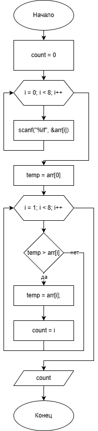

# Домашнее задание

## Условие задачи
С одномерным массивом, состоящим из n вводимых с клавиатуры
положительных и отрицательных целых чисел выполнить следующие
вычисления: Количество элементов массива, расположенных до минимального
элемента.

## 1. Алгоритм и блок-схема

### Алгоритм
1. **Начало**
2. Инициализировать переменные:
   - `arr[8]` (double) - массив для хранения 8 элементов
   - `count` (int) - счетчик элементов до минимального элемента
   - `temp` (double) - переменная для хранения текущего минимального значения
3. Запросить у пользователя ввод 8 элементов массива:
   - Использовать цикл `for` для последовательного ввода каждого элемента
4. Найти минимальный элемент и его индекс:
   - Инициализировать `temp` первым элементом массива
   - Инициализировать `count` нулем (индекс первого элемента)
   - Пройти по всем элементам массива, начиная со второго
   - Если текущий элемент меньше `temp`, обновить `temp` и запомнить индекс в `count`
5. Вывести количество элементов до минимального элемента (значение `count`)
6. **Конец**

### Блок-схема


[https://github.com/glebofrl/lab11VSTU/blob/master/scheme.png](https://github.com/glebofrl/lab11VSTU/blob/master/scheme.png)

## 2. Реализация программы

```
#include <stdio.h>
#include <locale.h>
#include <math.h>

void main() 
{
    setlocale(LC_CTYPE, "RUS");
    
    int count = 0;
    printf("Введите 8 элементов массива через enter:\n");
    
    double arr[8];

    // Ввод элементов массива
    for (int i = 0; i < 8; i++) {
        scanf("%lf", &arr[i]);
    }

    // Поиск минимального элемента и его индекса
    double temp = arr[0];
    
    for (int i = 1; i < 8; i++)
    {
        if (temp > arr[i]) 
        {
            temp = arr[i];
            count = i;
        }
    }
    
    // Вывод результата
    printf("Количество элементов массива, расположенных до минимального элемента: %d", count);
}
```
## 3. Результаты работы программы


## 4. Информация о разработчике

Глебов Илья, бИПТ-252
